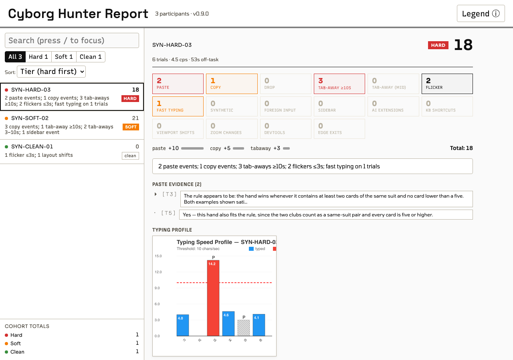

# cyborg-hunter

Detects AI-tool use during browser-based behavioral experiments. Captures paste, copy, drag, tab-away, mouse trajectories, browser sidebar openings, and other signals that compromise data quality on Prolific / MTurk / classroom studies and Qualtrics surveys. Produces a triage report ranking participants by suspiciousness.

Optional companion deterrence modules ship in the same package (`ch.js` bundles both; the separate `extension-guard-friction.js` and `extension-guard-honeypot.js` files are for manual mode): friction enforces fullscreen + blocks sidebars + scrambles content during violations + asks cooperative LLMs to refuse; honeypot exposes both hidden and visible bait fields that AI agents fill while human participants don't see them.

**[Try the live demo →](https://cyborg-hunter.github.io/cyborg-hunter/)** — run the tour in your browser; nothing leaves your machine.

**[Analyze your data in the browser →](https://cyborg-hunter.github.io/cyborg-hunter/analyze/)** — drop your data files and get the same report the CLI builds, processed in your browser. Once the page has loaded, its security policy makes the browser refuse every data request and form submission, and every load from another address. The page's own code never navigates away or opens another page, and automated tests fail the build if it ever requests or navigates anywhere else. Nothing is uploaded. Also available as a single offline file attached to each release.

### Example: what a report looks like

The bundled dataset (`examples/demo-sessions/`, four sessions recorded on the demo tour: three by the author, one by a GPT agent) triages like this:

| Rank | Participant | Tier | Score | Reason |
|------|-------------|------|-------|--------|
| 1 | DEMO-9mop | **HARD** | 45 | 4 paste events; 4 copy events; 4 tab-aways ≥10s; 1 tab-away 3–10s; 1 layout shifts; 44 synthetic insertions |
| 2 | DEMO-bsq6 | **HARD** | 21 | 2 paste events; 2 copy events; 1 tab-away ≥10s; fast typing on 3 trials; 44 synthetic insertions; pointer verdict: highly suspicious (clicks without a path 12/12) |
| 3 | DEMO-681w | soft | 13 | 1 paste events; 1 copy events; fast typing on 2 trials; 1 sidebar event; 2 layout shifts; 44 synthetic insertions |
| 4 | DEMO-a3f3 | clean | 11 | 1 paste events; 3 tab-aways 3–10s; fast typing on 1 trials; 1 sidebar event; 3 layout shifts; 1 zoom changes; 44 synthetic insertions |

Ranking is **tier-first** (hard-triggered lead, then soft, then clean), score-descending within a tier — here the scores happen to fall in the same order, but a hard-flagged participant leads a soft one with a higher score, because hard evidence beats any accumulation of soft evidence. By default the score is `5×paste + 5×copy + 3×sidebar + 1×tab-away` (counting tab-aways longer than the participant's tab-away threshold — 3s by default, 5s for the strict preset); synthetic insertions and fast typing are surfaced in the reason but do not drive the score unless you weight them with `scoreWeights` in the config. See [docs/cli-reference.md → Triage scoring](docs/cli-reference.md#triage-scoring). The HTML report for the same dataset:



Reproduce the table and page yourself: run `cyborg-hunter report` in `examples/demo-sessions/` ([docs/worked-example.md](docs/worked-example.md) interprets every number).

## Repo layout

- `src/core/` — signal-collection library (the monitor)
- `src/oneliner/` — the one-line files (`ch.js`, `ch-qualtrics.js`, `ch-labjs.js`)
- `src/jspsych/` — jsPsych extension adapters (one per concern)
- `src/cli/` + `bin/` — CLI that turns saved data into the triage report
- `tools/convert/` — `jspsych-v1-to-v2.mjs`, converts jsPsych `schema_version: 1` recordings to SessionRecording v2 (ships in the npm package)
- `demo/` — the interactive tour and the browser analyzer (`demo/analyze/`), both deployed to GitHub Pages
- `tests/`, `docs/` — tests, package docs
- `examples/demo-sessions/` — four sessions recorded on the demo tour, for trying the CLI (see [docs/worked-example.md](docs/worked-example.md))

Benchmarking and research tooling live in a separate repository.

## Install

CLI (analysis):

```bash
npm install -g cyborg-hunter
```

Browser (experiment page): one tag, below `jspsych.js` and above your experiment code (on a page without jsPsych, anywhere in the page; in `<head>`, recording starts at `DOMContentLoaded`):

```html
<script src="https://unpkg.com/cyborg-hunter@0.11.0/dist/ch.js"></script>
```

Each framework has its own one-line file, with the same API and the same tag attributes ([quickstart § Which file](docs/quickstart.md#which-file)):

| File | Use it for |
|---|---|
| `ch.js` | jsPsych 7 experiments, and pages without a framework |
| `ch-qualtrics.js` | Qualtrics surveys, in the survey's header ([docs/qualtrics.md](docs/qualtrics.md)) |
| `ch-labjs.js` | lab.js studies, below `lib/lab.js` ([docs/labjs.md](docs/labjs.md)) |

For production studies, pin a version: `https://unpkg.com/cyborg-hunter@0.11.0/dist/...`. You can also copy your framework's file (and `dist/cyborg-hunter-replay.js`, for session replay) into your project.

Manual mode (advanced), for experiments that wire the jsPsych extension themselves: see [docs/advanced-integration.md](docs/advanced-integration.md#manual-mode). It loads these files instead of `ch.js`:

```html
<!-- Signal collection -->
<script src="https://unpkg.com/cyborg-hunter/dist/cyborg-hunter.min.js"></script>
<script src="https://unpkg.com/cyborg-hunter/dist/extension-cyborg-hunter.js"></script>
<!-- Optional: deterrence + bait detection -->
<script src="https://unpkg.com/cyborg-hunter/dist/extension-guard-friction.js"></script>
<script src="https://unpkg.com/cyborg-hunter/dist/extension-guard-honeypot.js"></script>
<!-- Optional: session replay recorder -->
<script src="https://unpkg.com/cyborg-hunter/dist/cyborg-hunter-replay.js"></script>
```

## Plug into an experiment

Add the tag below `jspsych.js` and above your experiment code. Every trial is monitored and recorded as its own segment, and the integrity data lands in the data your experiment already saves. There is no extension list, no per-trial loop and no `finalize()` call.

```html
<script src="jspsych/jspsych.js"></script>
<script src="https://unpkg.com/cyborg-hunter/dist/ch.js"></script>
<script src="experiment.js"></script>
```

- Participant ID: ch.js reads it from the study URL or `data-participant-id`; see [docs/quickstart.md § Participant ID](docs/quickstart.md#participant-id).
- `data-guards`: the honeypot is on by default (read the [ethics and IRB note](docs/advanced-integration.md#honeypot-ethics-and-irb-note)); `data-guards="honeypot,friction"` adds friction, which enforces only after a start mark (`CyborgHunter.frictionEntryTrial()` in the timeline, or `data-ch-friction-start`) and otherwise just observes ([Friction](docs/advanced-integration.md#friction)); `data-guards="none"` turns both off.
- `data-replay`: records a session replay; save `CyborgHunter.replay()` in your save code.
- `data-debug`: an on-page badge and a console summary while piloting; remove it before launch, because participants see the badge.
- Without jsPsych: mark trials with `data-ch-trial="q1"` or `CyborgHunter.mark('q1')`, and save `CyborgHunter.data()` (a POST form gets it as a hidden `cyborgHunterData` field).
- Qualtrics: paste the `ch-qualtrics.js` tag into the survey's Look & Feel header and declare one embedded-data field; the CLI reads the CSV export ([docs/qualtrics.md](docs/qualtrics.md)).
- lab.js: the `ch-labjs.js` tag below `lib/lab.js` and above the study script; every lab.js screen is a trial, and the integrity data lands in lab.js's own rows ([docs/labjs.md](docs/labjs.md)).

Walk-through, placement and participant IDs: [docs/quickstart.md](docs/quickstart.md). Moving an experiment wired by hand: [docs/advanced-integration.md](docs/advanced-integration.md#switching-to-the-one-liner).

## Generate a report

```bash
cd <your-data-dir>
cyborg-hunter init                # writes cyborg-hunter.config.json
# edit config: dataDir, filePattern, participantIdField
cyborg-hunter report              # writes ./cyborg-hunter-report/
open cyborg-hunter-report/index.html
```

Output: `summary.csv` (per-participant columns), `triage.md` (ranked list), `event-log.csv` (chronological events), `images/` (per-participant mouse paths, session timelines, typing profiles), `index.html` (landing page).

## Session replay

The optional replay recorder captures what the participant did and (at the
`dom` tier) what the page looked like, so a flagged session can be reviewed
visually instead of adjudicated from counts alone. Recordings use the
`SessionRecording v2` wire format (`schema_version: 2`), specified in
[docs/session-recording-v2.md](docs/session-recording-v2.md) and developed
jointly with jsPsych; CH-only data (scoring, guard violations, sidebar
events) lives under `extensions["cyborg-hunter"]`. The recorder, the CLI
ingest and the report viewer all speak v2; the CLI also reads v2 files from
other producers and converts jsPsych `schema_version: 1` recordings on the
way in ([docs/v2-player-migration.md](docs/v2-player-migration.md)).
Releases before 0.8.0 recorded the earlier v1 shape.

With the one-line setup, replay is `data-replay` on the tag, and the experiment's save code saves what `CyborgHunter.replay()` returns ([details](docs/advanced-integration.md#replay-with-the-one-liner)):

```html
<script src="https://unpkg.com/cyborg-hunter/dist/ch.js" data-replay="dom"></script>
```

```javascript
// jsPsych with DataPipe: one more save trial, for the recording
timeline.push({
  type: jsPsychPipe,
  action: 'save',
  experiment_id: EXPERIMENT_ID,
  filename: participantId + '-replay-' + Date.now() + '.json',   // the experiment's variable holding the ID ch.js records
  data_string: () => JSON.stringify(CyborgHunter.replay())
});
```

Manual mode wires the recorder itself:

```javascript
// jsPsych: one more extension (declare anywhere; finalize LAST, see
// docs/advanced-integration.md#3-call-finalize-before-saving)
{ type: jsPsychCyborgHunterReplay, params: {
    participantId: participant_id,
    tier: 'dom',                                          // 'trace' (default) | 'dom'
    autoSave: { mode: 'datapipe', experimentId: 'ABC123' } } }
// on_finish: await jsPsych.extensions['cyborg-hunter-replay'].finalize();
```

```javascript
// Standalone (any experiment, no jsPsych)
const rec = CyborgHunterReplay.attach({ participantId, tier: 'dom',
  autoSave: { mode: 'datapipe', experimentId: 'ABC123' } });
rec.startSession();
rec.startTrial({ trialId: 'r1' });   // optional bracketing
rec.endTrial();
rec.stopSession('finished');
await rec.autoSaveNow();
```

The artifact saves as `<pid>-replay-<epoch>.json` next to your data; the CLI
picks it up automatically and the report gains a **Session replay** section
per participant (lazy-loaded scrub viewer — cursor trail, clicks, away
bands, and a sandboxed reconstruction of the page for `dom`-tier
recordings). On `dom`-tier recordings the cursor is verified per
interaction by a five-way alignment self-check — any click it can't
confirm draws an explicit uncertain marker instead of a wrong one, and
recordings made before this guarantee existed replay under a reduced-
guarantees banner. Password fields are always redacted; see
[docs/using-cyborg-hunter.md](docs/using-cyborg-hunter.md) for the privacy
model, data-volume guidance, delivery semantics, and the alignment
guarantee in full. Testing locally with `autoSave.mode: 'download'`:
Chromium-based browsers block the second automatic download (the CSV after
the replay, or vice versa), so use Firefox or Safari, or allow automatic
downloads for localhost; `datapipe` saves are unaffected.

## What it detects

| Signal | How | Class |
|---|---|---|
| Paste | Clipboard `paste` events | Hard (count threshold) |
| Drag-and-drop | `drop` events on inputs | Hard (count threshold) |
| Copy | Clipboard `copy` events | Soft (weighted) |
| Tab-away | `visibilitychange` + `blur`/`focus` | Soft (weighted) |
| Browser sidebar | `innerWidth` delta + layout compression | Soft (weighted) |
| Suspicious typing speed | chars/sec exceeding preset threshold | Soft (weighted) |
| Synthetic insertion | text appearing without keystrokes | Diagnostic (collected, not scored) |
| Foreign input | typing landing outside experiment container | Soft (weighted) |
| Idle gaps | input inactivity | Diagnostic (collected, not scored) |
| AI-extension content scripts | DOM scan for known extension selectors | Diagnostic (collected, not scored) |
| Mouse trajectories | 20Hz polling + path-efficiency metrics; the raw track ships in every trial report unless `collectForPostHoc.rawMouseTrack` is `false` | Diagnostic |
| Window/screen geometry | polled + resize-event capture, with zoom inference | Diagnostic |

Three presets: `permissive` / `standard` (default) / `strict`. Per-signal thresholds: [docs/signals-reference.md](docs/signals-reference.md).

Tab-aways are captured session-wide, not just during trials: since 0.6.1 the session report keeps a timestamped `tabAwayEvents[]` for every tab-away — including those during consent, tutorial, or study phases — so session timelines can place them. Data saved with older versions keeps only durations (`tabAwaySums`) for off-trial events; the timeline footer counts those as unplaceable. (0.6.1 also renames the `layoutShifts` signal to `viewportWidthShifts` — it measures viewport-width changes, not Web-Vitals CLS — keeping the old key as a deprecated alias.)

The **guards** (`data-guards` on the tag: the honeypot is on by default, friction is opt-in) add: fullscreen / sidebar / focus enforcement (with content-scrambling overlay on violation), AI refusal notices in the DOM, and honeypot fields (hidden + visible bait) that catch sidebar-LLMs and agentic browsers (Browser Use, Operator, Computer Use). The visible bait writes `ai_use` / `ai_report` columns into the experiment's saved data, and the report surfaces them in `summary.csv` as `honeypot_ai_use` / `honeypot_ai_report` (plus a "self-reported AI use" note in the triage reason).

## What it doesn't detect

- **Native browser AI sidebars** (Chrome Gemini, Edge Copilot) — they leave no extension content scripts. The `innerWidth_delta` heuristic still catches them as generic sidebar events, but the named-extension column stays empty.
- **Screen-share / second device** — an LLM on a phone reading the screen leaves no in-browser trace.
- **AI text edited and retyped** — a determined participant who retypes character-by-character without tab-switching looks clean. Mouse-trajectory and typing-rhythm signals raise the bar but it isn't a polygraph.

## Documentation

- [docs/quickstart.md](docs/quickstart.md) — zero to triage report
- [docs/qualtrics.md](docs/qualtrics.md) — the one-line setup in a Qualtrics survey: header tag, embedded-data field, payload cap, reading the export
- [docs/labjs.md](docs/labjs.md) — the one-line setup in a lab.js study: the `ch-labjs.js` tag below `lib/lab.js`, trial naming, the columns in lab.js's rows, reading the data
- [docs/advanced-integration.md](docs/advanced-integration.md) — manual mode, switching to the one-line setup, the honeypot's ethics note, friction, pages without jsPsych, replay
- [docs/worked-example.md](docs/worked-example.md) — full pipeline run on the bundled recorded sessions, outputs interpreted
- [docs/interpreting-signals.md](docs/interpreting-signals.md) — scores vs tiers, viewport shifts, phase scoping: the common misreadings
- [docs/upgrading.md](docs/upgrading.md) — what each release changes in collected data, configuration and reports; read before re-running old data
- [docs/using-cyborg-hunter.md](docs/using-cyborg-hunter.md) — full integration guide
- [docs/signals-reference.md](docs/signals-reference.md) — every signal with thresholds per preset
- [docs/configuration.md](docs/configuration.md) — config file fields and CLI flags
- [docs/cli-reference.md](docs/cli-reference.md) — commands and output structure
- [docs/session-recording-v2.md](docs/session-recording-v2.md) — the SessionRecording v2 wire format (joint with jsPsych)
- [docs/v2-player-migration.md](docs/v2-player-migration.md) — moving a v1 player or recording to v2
- [docs/known-issues.md](docs/known-issues.md) — open limitations and workarounds

## Reporting issues

Bug reports and feature requests go to the [issue tracker](https://github.com/cyborg-hunter/cyborg-hunter/issues); the bug form asks for your version and environment. One hard rule: issues are public, so never paste participant data (session payloads, replay files, identifiers). Reproduce with synthetic or personal test runs instead.

## Development

Run the test suite with `npm test`. Before publishing, run `scripts/check-public-hygiene.sh` — it fails if any tracked file contains personal or internal-process leakage.

## Citation

```bibtex
@software{konuk_cyborg_hunter,
  author  = {Konuk, Can and Btesh, Victor and Nunez, Jose Luis},
  title   = {cyborg-hunter: detecting AI-tool use in browser-based behavioral experiments},
  year    = {2026},
  version = {0.11.0},
  url     = {https://github.com/cyborg-hunter/cyborg-hunter},
  license = {MIT}
}
```

A "Cite this repository" button is rendered from `CITATION.cff`.

## License

MIT. The HTML report embeds six typefaces from Google Fonts (Space Grotesk,
Tomorrow, Sofia Sans, Sora, Recursive, Major Mono Display), each under the SIL
Open Font License 1.1; their licences ship in `src/cli/renderers/fonts/`.
